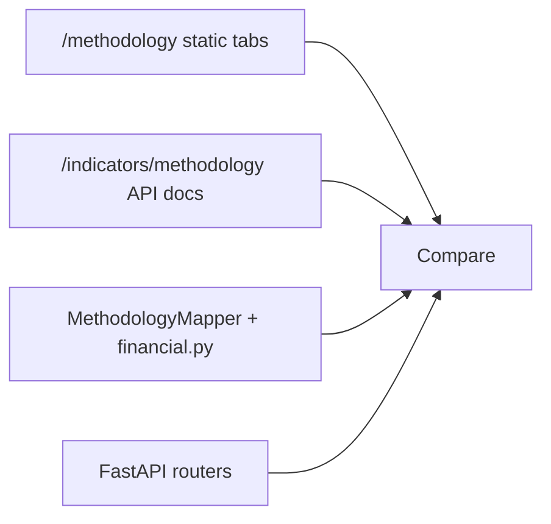

# Methodology documentation vs implementation — review

**Date:** 2026-03-24  
**Scope:** Bidirectional comparison of user-facing methodology text vs backend/frontend code. No fixes were applied in this pass.

## 1. Scope and method

### Surfaces reviewed

| Surface | Path | Role |
|--------|------|------|
| **Primary** | `frontend/src/app/methodology/page.tsx` | Tabbed static narrative (Overview → References). |
| **Secondary** | `frontend/src/app/indicators/methodology/page.tsx` | API-driven docs from `GET /api/indicators/methodology/{slug}`. |
| **Tertiary** | `README.md`, `CHANGELOG.md` | Product/marketing copy; high drift risk vs current stack. |

### Method

For each thematic area: **code → UI** (implementation supports claims) and **UI → code** (no phantom behaviour). Traceability targets: `backend/ecpm/indicators/*`, `modeling/*`, `api/*`, `structural/*`, `ingestion/pipeline.py`, `cache.py`, `cache_manager.py`, `validation.py`.

### Traceability diagram

---

## 2. Summary table (area × alignment)

| Area | Alignment | Notes |
|------|-----------|--------|
| A. Overview (modules, dual methodology) | **Partial** | Modules/routes exist; README/CHANGELOG contradict model family and methodologies. |
| B. Indicators (core + financial) | **Partial** | Financial four match well; core S/C series text oversimplifies Kliman; **Kliman capital series absent from `series_config.yaml`**. |
| C. Crisis index | **Aligned** | Mechanisms, inversion, logistic setup, threshold, fallback, and target window match code. |
| D. Forecasting (VECM, bootstrap, backtest) | **Mostly aligned** | VECM/bootstrap match; API module docs still say VAR; episode list matches `crisis-episodes.ts` / `backtest.py`. |
| E. Structural | **Mostly aligned** | L, shocks, linkages, θ=10%, critical rule match; “dependency count” narrative vs `L[:, j] > 0.01` is interpretive. |
| F. Concentration | **Mostly aligned** | CR/HHI, tiers, `data_source`, CR4 trend + R² broadly match; direction uses ±0.5 CR4/year thresholds not stated in UI. |
| G. Data verification | **Misaligned** | Caching story wrong for primary API path; Redis key pattern outdated; ingestion/LOCF/validation otherwise match. |
| H. References | **Aligned** | Citations map to features; Kliman publication year differs from mapper docstrings. |
| I. `/indicators/methodology` vs registry | **Aligned** | Slugs/methodologies match `MethodologyRegistry` + `IndicatorSlug`; duplication with static tabs is structural drift risk. |

---

## 3. Detailed findings

Each item: **claim** → **code** → **verdict** → **evidence**.

### A. Overview tab

1. **Claim:** Platform includes indicators, composite crisis index, VECM forecasting, structural I-O, concentration.  
   **Code:** Routes in `frontend/src/components/layout/sidebar.tsx` (`/indicators`, `/forecasting`, `/structural`, `/concentration`, `/methodology`); routers in `backend/ecpm/api/router.py`.  
   **Verdict:** **Matches.**

2. **Claim:** Only two Marxist methodologies (Shaikh/Tonak vs Kliman TSSI).  
   **Code:** `backend/ecpm/indicators/__init__.py` registers only `ShaikhTonakMapper` and `KlimanMapper`.  
   **Verdict:** **Matches** registry; **mismatch** vs `README.md` / `CHANGELOG.md` (still list **Moseley**, **VAR/SVAR**, **regime-switching**, **disproportionality component** in crisis index, etc.).

### B. Indicators tab (static) vs implementation

3. **Claim:** \(S\) from “NIPA Table 1.12 Line 1 − FRED A576RC1” for surplus value.  
   **Code:** Shaikh uses `BEA:T11200:L1` (millions) minus `A576RC1` (billions) after unit normalisation — consistent with spirit of “NI − compensation”. Kliman uses **`A053RC1Q027SBEA` − `A576RC1`** (`kliman.py`), not Table 1.12 Line 1.  
   **Verdict:** **Partial** — static page blends both methodologies into one S line; API/mappers on `/indicators/methodology` are the accurate split.

4. **Claim:** Shaikh C = `K1PTOTL1ES000`; Kliman C = `K1NTOTL1HI000`.  
   **Code:** `shaikh_tonak.py` / `kliman.py` use exactly those IDs.  
   **Verdict:** **Matches** code; **mismatch** vs **`backend/series_config.yaml`** — `K1NTOTL1HI000` is **not listed** under `fred:` while other capital series are. Unless ingested by another path, **Kliman cannot run on fresh installs** driven by YAML-only fetch. This is the strongest operational gap found.

5. **Financial four:** series IDs, 20-period rolling mean (productivity–wage), λ=400,000 one-sided HP, credit ÷1000 vs GDP billions, financial/real LOCF, debt service ÷1000 vs corporate income.  
   **Code:** `backend/ecpm/indicators/financial.py`.  
   **Verdict:** **Matches.**

6. **Parallel pass (static vs API mappers):**  
   **Code:** `MethodologyMapper.get_documentation()` consumed by `backend/ecpm/api/indicators.py`.  
   **Verdict:** **Partial** — static Indicators tab is a summary; detailed NIPA lines differ by methodology on the API page. Expect ongoing duplication/divergence.

### C. Crisis index tab

7. **Mechanism membership (TRPF / realization / financial).**  
   **Code:** `MECHANISM_INDICATORS` in `backend/ecpm/modeling/crisis_index.py` — same eight slugs as UI lists.  
   **Verdict:** **Matches.**

8. **Global percentile rank; invert rate of profit and rate of surplus value; mean sub-indices.**  
   **Code:** `compute_sub_indices` — `rank(pct=True)`, `_CRISIS_INVERTED`, `_CRISIS_POSITIVE`.  
   **Verdict:** **Matches** (UI omits explicit “invert mass of profit” — correctly, since mass is not inverted).

9. **Logistic regression: L2, `threshold=0.25`, `StandardScaler`, `class_weight='balanced'`, |β| normalisation, 5-fold ROC-AUC, &lt;30 samples → equal weights.**  
   **Code:** `learn_weights` in `crisis_index.py`.  
   **Verdict:** **Matches.**

10. **Crisis proximity: 12-month forward mean of USREC.**  
    **Code:** `crisis_target.py` — `shift(-1).rolling(12).mean()` ≡ mean of months \(t+1\ldots t+12\). UI formula \(\frac{1}{12}\sum_{k=1}^{12}\text{USREC}_{t+k}\) is **equivalent**.  
    **Verdict:** **Matches.**

### D. Forecasting tab

11. **VECM, Johansen trace, rank-0 → rank 1, quarterly resample, short lags.**  
    **Code:** `fit_vecm` in `vecm_model.py` — `coint_rank == 0` forces 1; `k_ar_diff` capped at **2** (difference lags in quarters); `_resample_to_quarterly`. Training calls `fit_vecm(..., max_lags=12)` (`training_tasks.py`) for Johansen lag search but fitted `k_ar_diff` remains capped at 2.  
    **Verdict:** **Matches** UI “max 2 (in quarters)” for the **fitted** VECM; Johansen uses a higher search bound — acceptable if prose is read as estimation lags.

12. **Bootstrap: 1000 reps; 68% = 16–84%; 95% = 2.5–97.5%.**  
    **Code:** `_recursive_bootstrap_ci` — `n_boot=1000`, `alpha_68=0.32`, `alpha_95=0.05`.  
    **Verdict:** **Matches.**

13. **Backtest: 14 episodes; 75th percentile; 12- and 24-month pre-start windows.**  
    **Code:** `backtest.py` — `CRISIS_EPISODES` comment points to `crisis-episodes.ts`; same dates; `quantile(0.75)`; windows `[start−12m, start)` and `[start−24m, start)`.  
    **Verdict:** **Matches.**

14. **Forecasting API module docstring still describes “VAR forecast”.**  
    **Code:** `backend/ecpm/api/forecasting.py` lines 1–12.  
    **Verdict:** **Mismatch** (documentation drift, not user methodology tab).

### E. Structural tab

15. **\(\mathbf{L}=(\mathbf{I}-\mathbf{A})^{-1}\), \(\Delta x = L d\), superposition, column sums = backward, row sums = forward.**  
    **Code:** `structural/shock.py` — `simulate_shock`, `simulate_multi_sector_shock`, `compute_backward_linkages`, `compute_forward_linkages`.  
    **Verdict:** **Matches.**

16. **Critical sectors: \(BL_j > (1+\theta)\overline{BL}\), default θ=10%.**  
    **Code:** `find_critical_sectors(..., threshold: float = 0.1)`. API passes threshold from query (`structural.py`).  
    **Verdict:** **Matches.**

17. **Weakest link + dependency count at &gt;1%.**  
    **Code:** `find_weakest_link` — `dependency_count = np.sum(L[:, weakest_idx] > 0.01)`.  
    **Verdict:** **Partial** — UI describes “sectors that require its output”; code counts large **column** entries \(L_{i,\text{weakest}}\) (input structure per unit of weakest sector final demand). Economically related but not the same sentence as the UI.

### F. Concentration tab

18. **CRk, HHI ×10,000, tiering EDGAR → Census → estimated, `data_source`.**  
    **Code:** `api/concentration.py`, `tasks/concentration_tasks.py`, schemas (`edgar` / `census` / `estimated`).  
    **Verdict:** **Matches.**

19. **Linear trend on CR4 with R².**  
    **Code:** `concentration/metrics.py` — `compute_trend` uses `scipy.stats.linregress`; stores `r_squared`.  
    **Verdict:** **Matches** functional claim.

20. **Trend labels “increasing/stable/decreasing” from slope sign.**  
    **Code:** Directions require **|slope| &gt; 0.5** (CR4 points per year) for non-stable.  
    **Verdict:** **Partial** — UI implies generic sign of slope; implementation suppresses small slopes as “stable”.

### G. Data verification tab

21. **Ingestion: NaN → NULL, `gap_flag=True`; upsert; `fetch_status='error'`; metadata.**  
    **Code:** `ingestion/pipeline.py` docstring and implementation.  
    **Verdict:** **Matches** (UI correctly scopes FRED/BEA; other sources exist elsewhere but do not contradict).

22. **LOCF-only alignment.**  
    **Code:** `definitions.py` (`FREQUENCY_STRATEGY: "LOCF"`); financial real assets `ffill` in `financial.py`.  
    **Verdict:** **Matches.**

23. **Unit reconciliation table (A576 ×1000, BOGZ ÷1000, etc.).**  
    **Code:** `shaikh_tonak` (NI millions→billions, assets millions→billions), `financial.py` credit/debt conversions.  
    **Verdict:** **Matches.**

24. **Caching: “Redis … `indicators:{slug}:{methodology}` … 1h TTL”.**  
    **Code:** Primary paths: `api/indicators.py` uses **`cache_manager.py` disk files** under `/app/cache/indicators/{methodology}/` with **24h TTL** (`CACHE_TTL_HOURS = 24`) for overview and per-indicator **when no date filter**; `compute_indicator` is called with **`redis=None`**, so **Redis caching inside `computation.py` is bypassed** for those endpoints. Redis **is** used with `build_cache_key` → keys like `ecpm:api:api:indicators:...` for methodology listing/detail cache and compare (`_DATA_CACHE_TTL = 3600`). `computation.py` docstring still says `indicators:{slug}:{methodology}`.  
    **Verdict:** **Mismatch** — operators/users following the Data Verification tab get the wrong picture for the main indicator API.

### H. References tab

25. **Kliman cited as (2011) on UI; mapper cites (2012).**  
    **Code:** `kliman.py` module docstring “Kliman (2012)”.  
    **Verdict:** **Partial** — bibliographic inconsistency only.

26. **Marx / Shaikh / Kliman / Johansen / Lütkepohl / BIS / Leontief / data URLs.**  
    **Verdict:** **Aligned** with features still present (no orphaned primary citations).

### I. `/indicators/methodology` sub-route

27. **Slugs `shaikh-tonak` and `kliman`; indicator set.**  
    **Code:** `MethodologyRegistry`; `IndicatorSlug` has eight values — methodology docs cover the four core per mapper plus financial documented via mappers (exact coverage depends on each mapper’s `get_documentation()`).  
    **Verdict:** **Matches** wiring; content depth is per-mapper vs static tabs.

---

## 4. Internal inconsistencies (between surfaces)

| Topic | `/methodology` (static) | `/indicators/methodology` + API | README / CHANGELOG |
|--------|-------------------------|----------------------------------|---------------------|
| Marxist methodologies | Two (Shaikh/Tonak, Kliman) | Two mappers | **Moseley** and extra crisis mechanisms claimed |
| Forecasting model | VECM | N/A | **VAR/SVAR**, 8-quarter horizon emphasis, regime-switching |
| Crisis index components | Three mechanisms, eight indicators | N/A | **Four** components, **disproportionality**, different framing |
| Caching | Redis key + 1h | N/A | “Cached in Redis” (README) without disk layer |
| Kliman national income | Implied same as Shaikh in one bullet | Mapper-specific series | N/A |

---

## 5. Suggestions (not executed here)

1. **Add `K1NTOTL1HI000` to `series_config.yaml`** (and verify ingestion/pipeline) so Kliman matches documented data requirements, or document that Kliman is disabled until the series is configured.

2. **Rewrite the Data Verification “Caching & Freshness” section** to describe the **disk-first** indicator cache (path, 24h TTL), optional Redis for compare/methodology aggregate endpoints, and the real `build_cache_key` prefix (`ecpm:api:...`).

3. **Update `computation.py` module docstring** and **`api/indicators.py` top comment** (“All endpoints use Redis…”) to match actual `redis=None` usage on hot paths.

4. **Harmonise README and CHANGELOG** with VECM, two methodologies, and current crisis-index structure—or add a banner that historical changelog entries are obsolete.

5. **Unify Kliman citation year** (2011 vs 2012) across UI, mappers, and references.

6. **Clarify static Indicators tab** for \(S\): split Shaikh (BEA 1.12 L1 − compensation) vs Kliman (FRED national income − compensation), or link prominently to `/indicators/methodology`.

7. **Concentration trend copy:** mention ±0.5 CR4 points/year thresholds for directional labels, or change labels to match plain regression slope sign.

8. **Structural “dependency count”:** align prose with `L[:, j] > 0.01` or adjust metric to match the intended economic reading.

9. **Long-term:** consider a **single source of truth** for indicator methodology (generate static tabs from the same JSON the API serves) to prevent static vs API drift.

---

## 6. Implementation plan (from §5)

### Post-overhaul verification (2026-03-24)

The Kliman TSSI overhaul has merged and all pinned items have been resolved. Status of each phase:

| ID | Task | Status | Resolution |
|----|------|--------|------------|
| **A1** | Rewrite Caching & Freshness section | **Done** | Two-layer (disk + Redis) description on methodology page matches `cache_manager.py` and `api/indicators.py`. |
| **A2** | Update `computation.py` and `api/indicators.py` docstrings | **Done** | Module headers describe disk-first caching with selective Redis. |
| **A3** | Harmonise README + CHANGELOG | **Done** | Moseley, VAR/SVAR, regime-switching, disproportionality references replaced with VECM, two mappers, three-mechanism crisis index. |
| **B1** | Concentration trend thresholds | **Done** | Methodology page now documents ±0.5 CR4 points/year thresholds for direction labels. |
| **B2** | Structural dependency count | **Done** | Prose now describes `L[:, j] > 0.01` column-of-Leontief-inverse semantics. |
| **C1** | Clarify static S definition | **Done** | S definition split into Shaikh (BEA T11200 L1 − compensation) and Kliman (FRED A053RC1Q027SBEA − compensation) with pointer to `/indicators/methodology`. |
| **C2** | Kliman YAML + citation year + S split | **Done** | `K1NTOTL1HI000` added to `series_config.yaml`; Kliman citation unified to 2012 across UI and backend; full Shaikh/Kliman S split in static Indicators tab. |

### Phase D — Long-term (optional epic)

| ID | Task | Notes |
|----|------|--------|
| D1 | Single source of truth for indicator methodology (suggestion **9**): e.g. build static tabs from `MethodologyMapper.get_documentation()` or a shared JSON artifact in CI. | Reduces static vs `/indicators/methodology` drift; schedule when product priority warrants. |

---

*End of report.*
